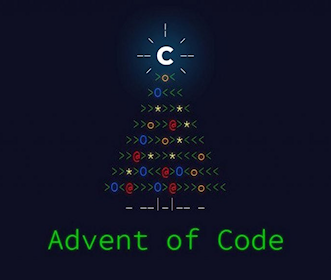

  

----

Hoping to make this a "Polyglot" Advent of Code. 

The idea is to try to solve the various puzzles in one of `Golang`, `Java`, `C#`, `Node` and `Python`  (maybe rotate each day?!)

Thank you to the [CapTech](https://captechconsulting.com/) crew for throwing down the gauntlet and helping to keep me inspired/on track throughout the challenge
